# **TIC - TAC - TOE**

## Project Description

Tic-Tac-Toe is a simple two-player game, and only two players can play at a time. This game is also known as Noughts and Crosses or Xs and Os game. One player plays with X and the other player plays with O. In this game we have a board consisting of a 3X3 grid, and in this case player 1 is X and Player 2 is O.


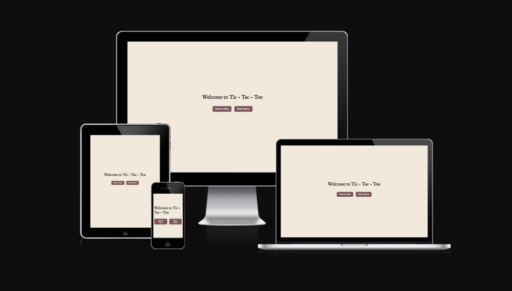
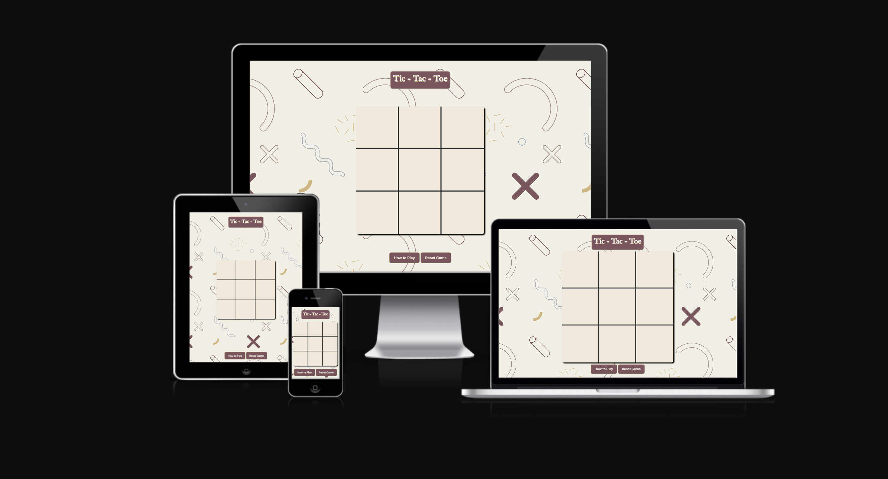

The above website screenshot was generated using [ui.dev/amiresponsive](https://ui.dev/amiresponsive)

To view the live website on GitHub Pages click [Tic Tac Toe](https://nelkon01.github.io/tic-tac-toe)

# Contents

* [**Objective**](<#objective>)
* [**User Experience**](<#user-experience-ux>)
  * [**User Stories**](<#user-stories>)
  * [**Wireframes**](<#wireframes>)
  * [**Structure**](<#structure>)
  * [**Design**](<#design>)
    * [**Colour Scheme**](<#colour-scheme>)
    * [**Typography**](<#typography>)
    * [**Imagery**](<#imagery>)
* [**Features**](<#features>)
  * [**Existing Features**](<#existing-features>)
  * [**Future Features**](<#future-features>)
* [**Technologies Used**](<#technologies-used>)
* [**Testing**](<#testing>)
* [**Testing User Stories**](<#testing-user-stories-from-user-experience-ux-section>)
* [**Validator Testing**](<#validator-testing>)
  
* [**Deployment**](<#deployment>)
* [**Credits**](<#credits>)
  * [**Content**](<#content>)
  * [**Media**](<#media>)
* [**Acknowledgments**](<#acknowledgements>)

# **Objective**
To fufil the requirements of my portfolio project two, I am developing this web application to demonstrate my competency in building a dynamic, interactive Front end web application which also includes understanding user input and control when interacting with a web application. This project will also showcase my attention to details and the importance of thorough testing.

# **User Experience (UX)**

- ## **User stories**
  - ### **First Time Visitor Goals:**
  1. As a first-time users, I want to understand that it is a two player game.
  2. As first-time users, we want to understand how to play the game.
  3. As first-time users, we want to easily navigate and find the game board.
  4. As first-time users, we want clear instructions on how to make moves and win the game.
  5. As first-time users, we want a visually appealing and intuitive interface for an enjoyable gaming experience.
  6. As first-time users, we want to be able to reset the game if we want to start over.
  7. As first-time users, we want to easily know which of the players has won or if there is a tie.

  -   ### **Returning Visitor Goals:**
  1. As returning visitors, we want to quickly start a new game without any hassle.
  2. As returning visitors, we want to easily find the "How to Play" instructions in case theres a need for refresher.
  4. As returning visitors, we want to see if any updates or improvements have been made to the game since our last visit.

  - ### **Frequent User Goals:**
  1. As frequent users, We want to compete against another player to test our skills.


        
-   ## **Wireframes**
    ### Mobile
    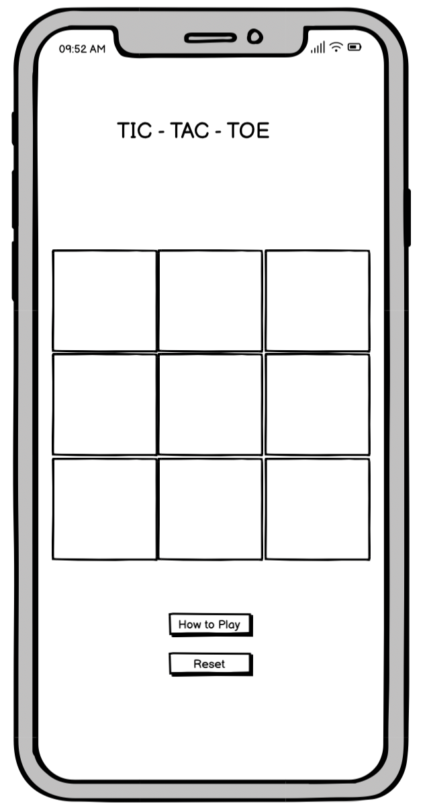
    ### Tablet
    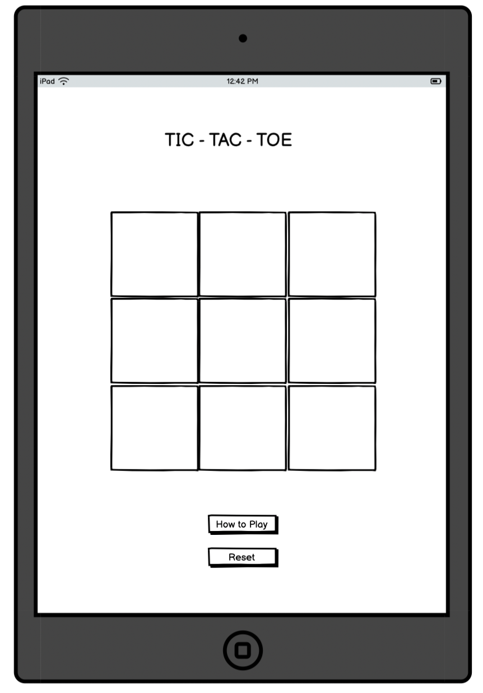
    ### PC
    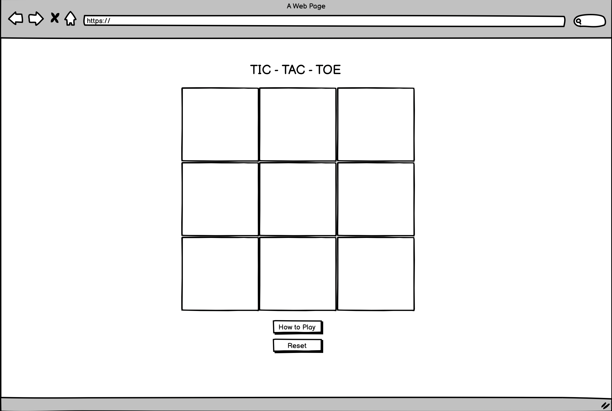
-   ## **Structure**
The web app has 2 pages. 
[Welcome Page](https://nelkon01.github.io/tic-tac-toe/index.html) is the default landing page that welcomes users to the web app.
[Game Page](https://nelkon01.github.io/tic-tac-toe/game.html) is the page where the game board is located and all the game functionality. This can be navigated by clicking the start game button.

-   ## **Design**
    -   ### Colour Scheme
    
        
    -   ### Typography
    The font used in the for the header is the [IM Fell English](https://fonts.google.com/specimen/IM+Fell+English) with Sans Serif as the fall back font in case for any reason the font isn't being imported into the site correctly or browser compatibility issues. I think the font is also fits in nicelyb with the design of the webgame.
        
    -   ### Imagery
      Imagery is important. the game uses a background image on the game page which goes nicely with the theme and important parts of the game. The images used in the modals to give users any messages are also fit for the whatever message is being passed.
      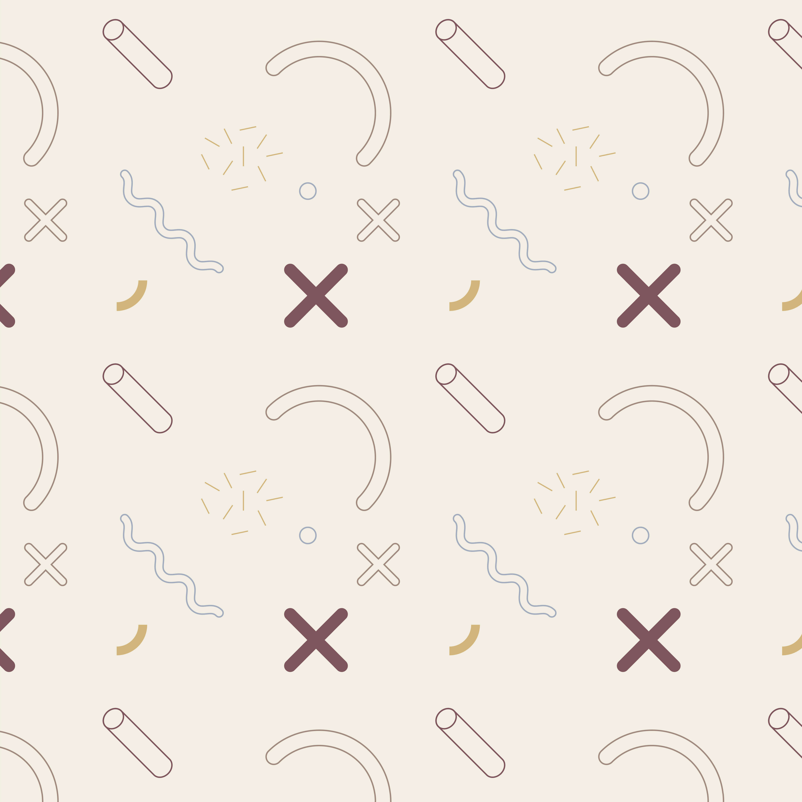

      

# **Features**
      
## **Existing Features**

  ### **Game Board**
  The game board is displayed on the webpage, consisting of a 3x3 grid where players can make their moves.
  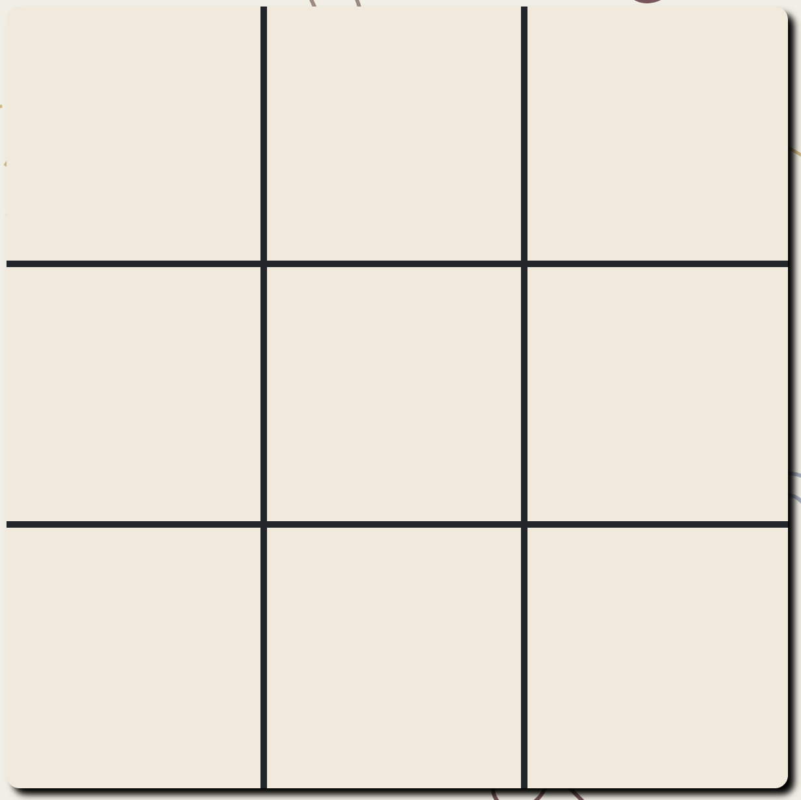

  ### **Player Turns**
  Players can take turns placing their marks (X or O) on the empty squares of the game board.
  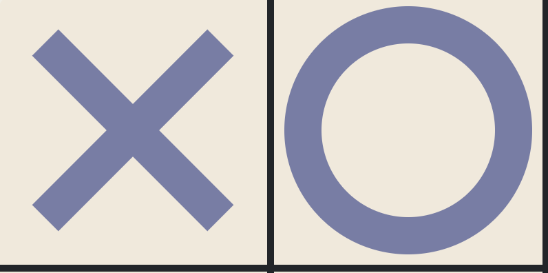

  ### **Winning Condition**
  The game checks for a winning condition where the first player to get three of their marks in a row (horizontally, vertically, or diagonally) wins the game.
  There is also an added functionality    
  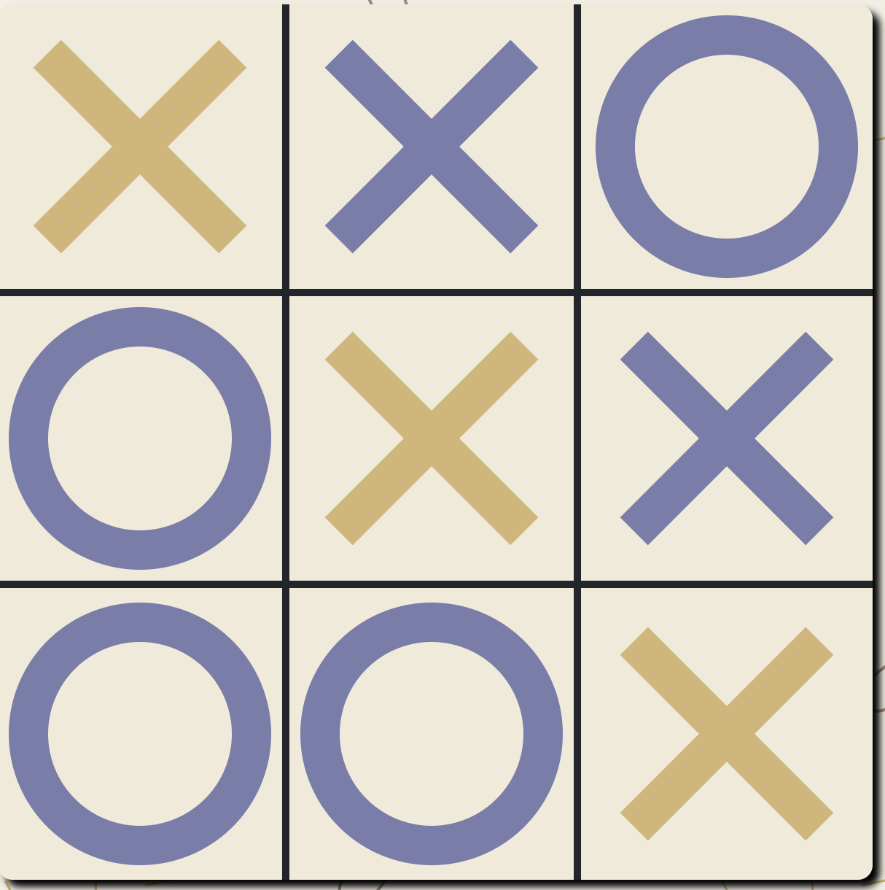

  ### **Tie Game**
  If all nine squares on the game board are filled and no player has won, the game ends in a tie.
  ### **Reset Game**
  There is a "Reset Game" button that allows players to start a new game, clearing the game board and resetting the scores.
 
  ### **Modal Windows**
  The game includes modal windows for displaying messages and information, such as the "How to Play" instructions, tie game notification, and winner announcement.
  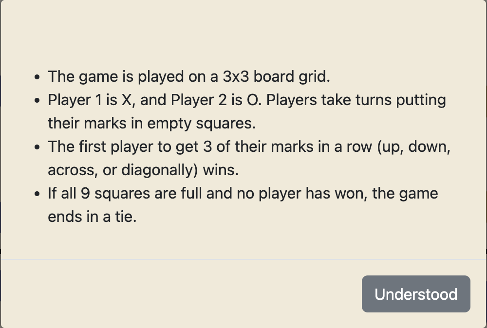
  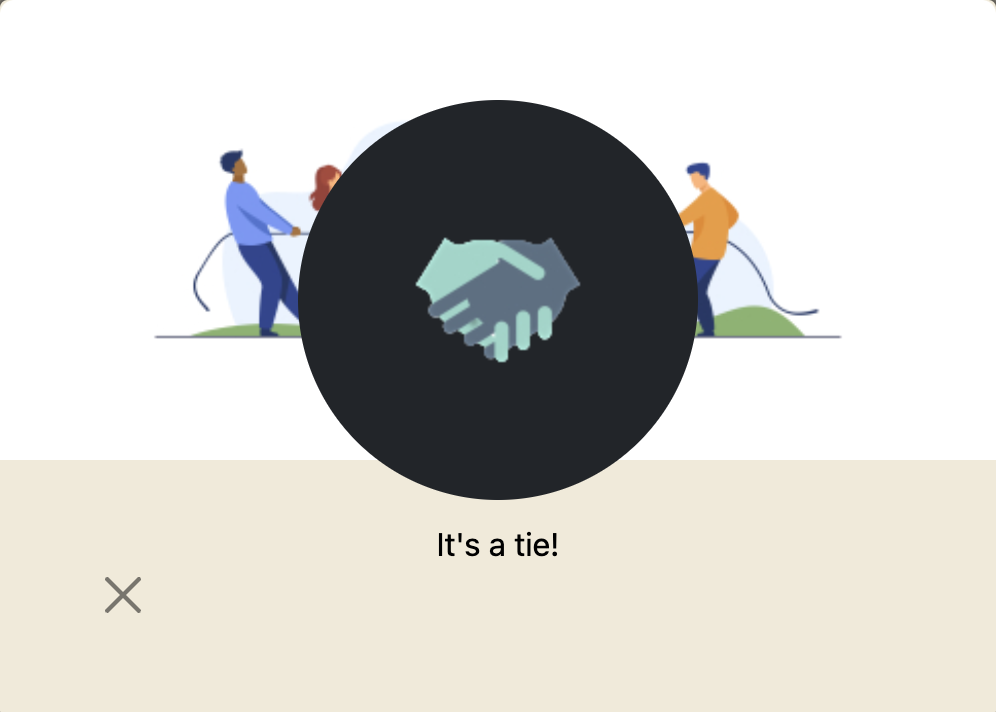
  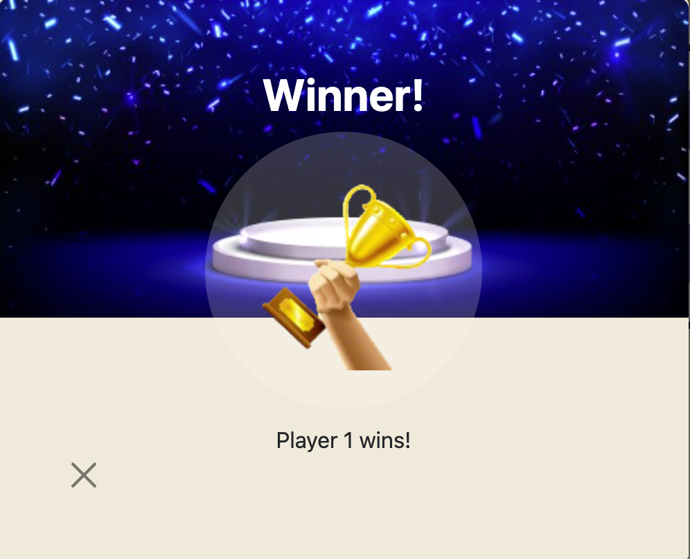

  ### **Favicon**
  The project includes a favicon, a small icon displayed in the browser tab.
  
  ### **External Dependencies**
  The project utilizes external libraries, including Bootstrap (CSS and JavaScript) and jQuery.
  ### **Responsive Design**
  The webpage is designed to be responsive and adapt to different screen sizes and devices. 
  - #### Mobile
  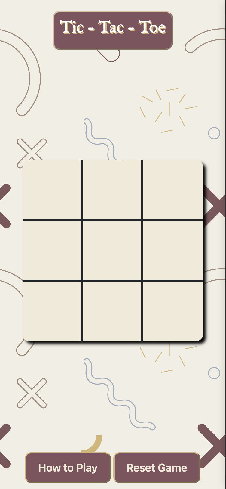
    
  - #### Tablets

  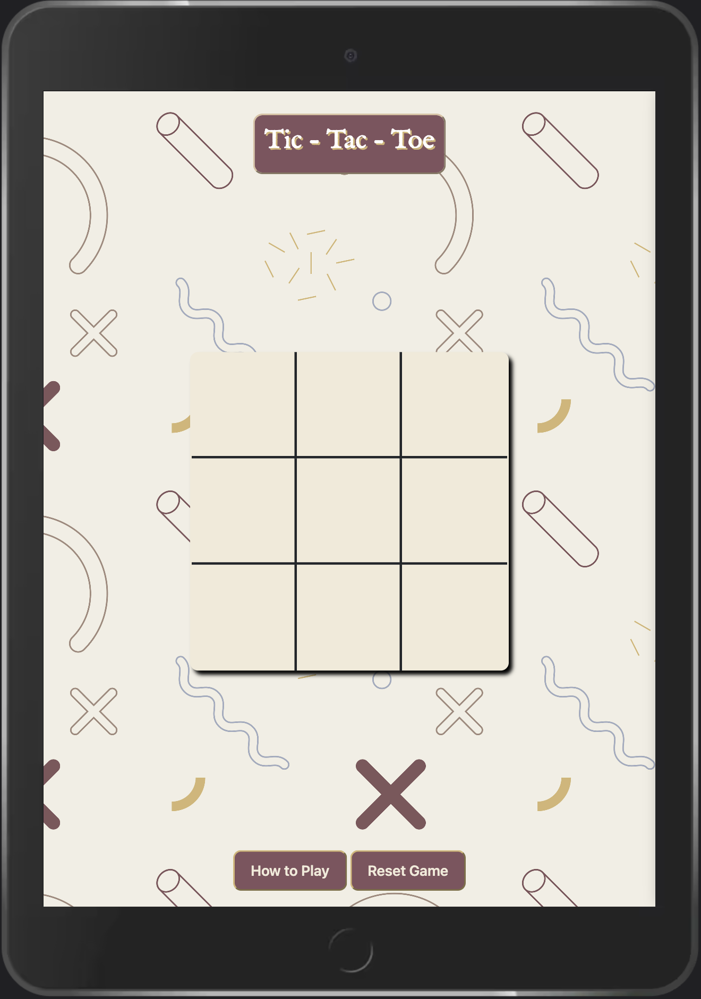
  - #### Desktop
  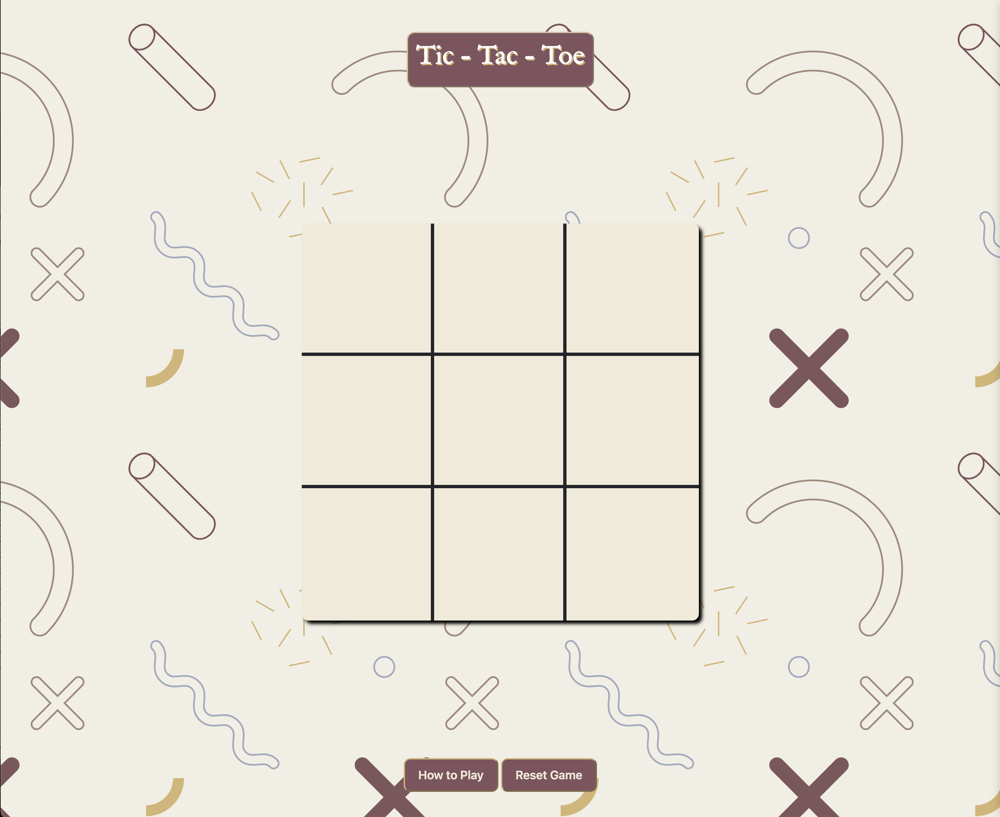
## **Future Features**
  ### **Single Player Mode**
  Implement an AI opponent to allow users to play against the computer.
  ### **Difficulty Levels**
  Add different difficulty levels for the AI opponent, providing a range of challenges for players.
  ### **Multiplayer Mode**
  Enable users to play against each other online, either locally or across different devices.
  ### **Score Tracking**
  Implement a scoring system to keep track of wins, losses, and ties for each player.
  ### **Player Names**
  Allow players to enter their names or choose from predefined usernames for a personalized experience.
  ### **Visual Effects**
  Enhance the game with animations, sound effects, and visual feedback for player moves and game outcomes.
  ### **Game Statistics**
  Provide statistics and analytics to track game history, including win/loss ratios and game duration.
  ### **Undo/Redo Moves**
  Implement the ability to undo or redo moves during gameplay to provide more flexibility and strategic options.
  ### **Accessibility Features:**
  Ensure the game is accessible to users with disabilities by implementing features like keyboard navigation and screen reader support.
 


# **Technologies Used**

## **Languages Used**

-   [HTML5](https://en.wikipedia.org/wiki/HTML5)
-   [CSS3](https://en.wikipedia.org/wiki/Cascading_Style_Sheets)
-   [JavaScript](https://www.javascript.com/)

## **Frameworks, Libraries & Programs Used**
### **[Bootstrap](https://getbootstrap.com/docs/5.3/getting-started/introduction/)** 
- Used for utilizing pre-designed CSS styles and components for a responsive layout.
### **[jQuery](https://jquery.com/)**
- Used for simplifying DOM manipulation and event handling.
### **[Git](https://git-scm.com/)**
- Used for version control and managing the project's source code.
### **[GitHub](https://github.com)**
- Used for hosting the project repository.

### **[Visual Studio Code](https://code.visualstudio.com/)** 
- A popular code editor used for developing the game.
### **[Font Awesome](https://fontawesome.com/)**
- Font Awesome was used to show the media icons in the footer.

### **Browser Developer Tools**
- Used for debugging and inspecting the game's behavior in different web browsers.
 
### **[Balsamiq](https://balsamiq.com/)**
  - Balsamiq was used to create the [wireframes](<#wireframes>) during the design process.


# **Testing**
    
### Testing User Stories from User Experience (UX) Section

-   #### First Time Visitor Goals
  1. As a first-time users, I want to understand that it is a two player game.
  - On the page that welcomes users to the web app, there is a how to play button and once clicked, the game instructions appear which lets users know it is a 2 player game.
  2. As first-time users, we want to understand how to play the game.
  - This is achieved by the presence of the how to play button present on the page that welcomes players to the game.
  3. As first-time users, we want to easily navigate and find the game board.
  - Players can esily see the start game button on the first page which will navigate them to the game board. 
  4. As first-time users, we want clear instructions on how to make moves and win the game.
  - This is achieved by the information the how to play button reveals once the how to play button is clicked on both pages
  5. As first-time users, we want a visually appealing and intuitive interface for an enjoyable gaming experience.
  - This is achieved by the use of visually appealing images on the background and and the modals
  6. As first-time users, we want to be able to reset the game if we want to start over.
  - A reset game button is present on the game screen to enable users perform this action
  7. As first-time users, we want to easily know which of the players has won or if there is a tie.
  - Bootstraps modals have been used to achieve achieve this functionality and pass messages accross to users on the game page if theres a win or tie game.

   
    

-   #### Returning Visitor Goals
  1. As returning visitors, we want to quickly start a new game without any hassle.
  - Users can start start new games or reset boards an unlimitedly.
  2. As returning visitors, we want to easily find the "How to Play" instructions in case theres a need for refresher.
  - The how to play button on the game page shows a modal popup with instructions to help users with this.
  3. As returning visitors, we want to see if any updates or improvements have been made to the game since our last visit.
  - Any updates to the game will be positioned and commi=unticated to users in a visually appealling and intuitive way. 

-   #### Frequent User Goals
  1. As frequent users, We want to compete against another player to test our skills.
  - There is no limit to which users can play and compete against each other. 


### Further Testing
-   The Website was tested on Google Chrome, Internet Explorer, Microsoft Edge. Mozilla Firefox and Safari browsers.
-   The website was viewed on a variety of devices such as Desktop, Laptop, iPad Pro, iPad Air, iPhone 13, iPhone 13pro Max, Samsung s20, & iPhone 14 .
-   A large amount of testing was done to ensure that all links were working appropriately
-   Friends and family members were asked to review the site and documentation to point out any bugs and/or user experience issues.


### Bugs

- Encountered bugs when trying to implement a functionality that will change the color of winning cells player mark when win condition has been bet. It wasn't displaying the chosen color at first, and retained the winning color class after reset bnutton had been clicked. 
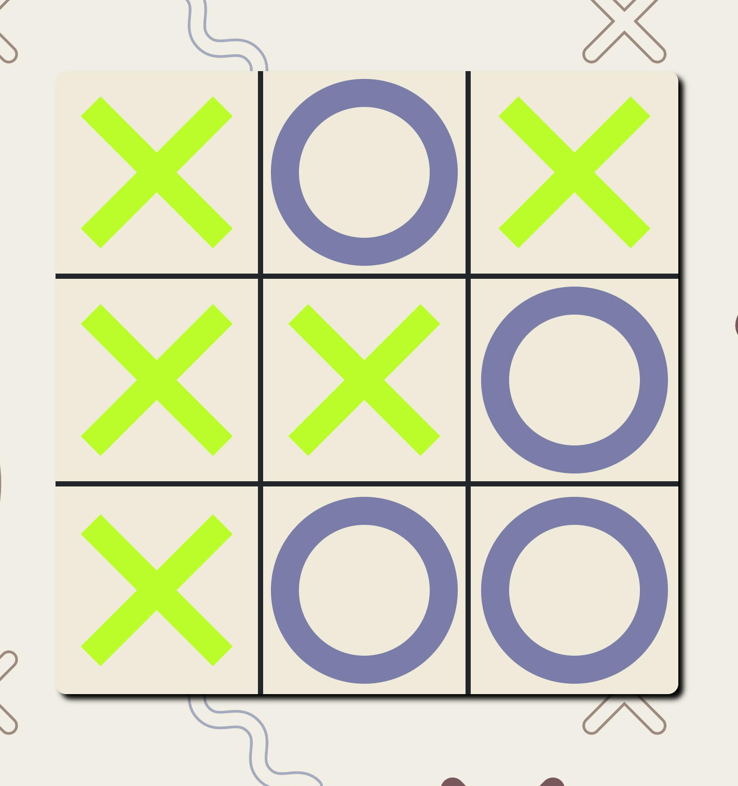
- FIX: Updated the checkwin function in javascript to store the cells into an array, and then added a highlight cells function to add the winning class styling to the winning cells array.
- Noticed the header appearing a little differently in different phones. Below is the screenshot iphone 13 and iphone 14 pro max models.
- iPhone 13 Pro Max
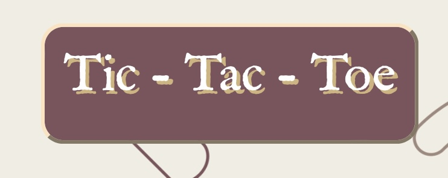
- iPhone 14 Pro Max
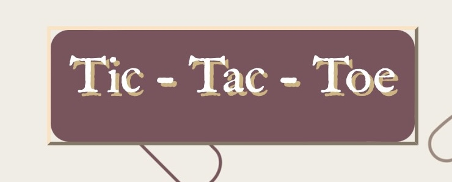

Fix: This has not been fixed


# **Validator Testing**

 
# **Deployment**
### GitHub Pages

The project was deployed to GitHub Pages using the following steps...

1. Log in to GitHub and locate the [GitHub Repository](https://github.com/Nelkon01/tic-tac-toe)
2. At the top of the Repository (not top of page), locate the "Settings" Button on the menu.
    - Alternatively Click [Here](https://raw.githubusercontent.com/) for a GIF demonstrating the process starting from Step 2.
3. Scroll down the Settings page until you locate the "GitHub Pages" Section.
4. Under "Source", click the dropdown called "None" and select "Master Branch".
5. The page will automatically refresh.
6. Scroll back down through the page to locate the now published site [link](https://github.com) in the "GitHub Pages" section.

### Forking the GitHub Repository

By forking the GitHub Repository we make a copy of the original repository on our GitHub account to view and/or make changes without affecting the original repository by using the following steps...

1. Log in to GitHub and locate the [GitHub Repository](https://github.com/Nelkon01/tic-tac-toe)
2. At the top of the Repository (not top of page) just above the "Settings" Button on the menu, locate the "Fork" Button.
3. You should now have a copy of the original repository in your GitHub account.

### Making a Local Clone

1. Log in to GitHub and locate the [GitHub Repository](https://github.com/Nelkon01/afro_experience_website)
2. Under the repository name, click "Clone or download".
3. To clone the repository using HTTPS, under "Clone with HTTPS", copy the link.
4. Open Git Bash
5. Change the current working directory to the location where you want the cloned directory to be made.
6. Type `git clone`, and then paste the URL you copied in Step 3.

```
$ git clone https://github.com/Nelkon01/tic-tac-toe
```

7. Press Enter. Your local clone will be created.

```
$ git clone https://github.com/Nelkon01/tic-tac-toe
> Cloning into `CI-Clone`...
> remote: Counting objects: 10, done.
> remote: Compressing objects: 100% (8/8), done.
> remove: Total 10 (delta 1), reused 10 (delta 1)
> Unpacking objects: 100% (10/10), done.
```

Click [Here](https://help.github.com/en/github/creating-cloning-and-archiving-repositories/cloning-a-repository#cloning-a-repository-to-github-desktop) to retrieve pictures for some of the buttons and more detailed explanations of the above process.


# **Credits**

### Code

-   [Bootstrap 5](https://getbootstrap.com/docs/5.3/getting-started/introduction/): Bootstrap Library used throughout the project mainly to make site responsive and to utilize bootsrap styling and modals which gave users information popups.
- [Web Dev Simplified YouTube](https://www.youtube.com/watch?v=Y-GkMjUZsmM&t=1896s): This video helped me understand a nice way i wanted to achieve the board styling and the player marks.

### Content


### Media

- Background Image was <a href="https://www.freepik.com/free-vector/memphis-seamless-pattern-background_16396978.htm#query=tic%20tac%20toe%20Background&position=0&from_view=search&track=ais">Image by rawpixel.com</a> on Freepik
- Favicon image was <a href="https://www.flaticon.com/free-icons/tic-tac-toe" title="tic tac toe icons">Tic tac toe icons created by Freepik - Flaticon</a>
- The image on winning modal was <a href="https://www.freepik.com/free-vector/hand-holding-winner-trophy-cup-award_3949342.htm#query=win&position=20&from_view=search&track=sph">Image by macrovector</a> on Freepik
- Background image on winning modal was <a href="https://www.freepik.com/free-vector/podium-with-falling-confetti-round-gold-shiny_32230557.htm#query=winner%20background&position=26&from_view=search&track=ais">Image by upklyak</a> on Freepik
- Tie background image on tie modal was <a href="https://www.freepik.com/free-vector/teams-competing-prize-people-playing-tug-war-pulling-rope-with-golden-cup-flat-vector-illustration-competition-contest-concept_10613684.htm#query=tie%20game&position=8&from_view=search&track=ais">Image by pch.vector</a> on Freepik
### Acknowledgements

- Bootstrap modal inspriration was gotten from <a href="https://colorlib.com/wp/bootstrap-modals/">colorlib</a>
- This website was helpful to reduce and resize images <a href="https://www.reduceimages.com/">reduceimages</a>
